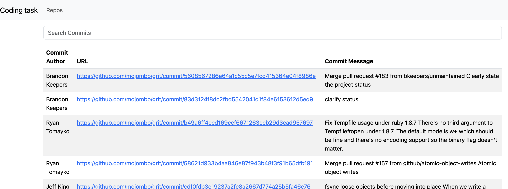

# Github coding task

## Introduction

Gitalo is a web application built with Angular that allows users to explore repositories on Github. Users can search for repositories by name, view repository details, and see the commits for a selected repository.

## Features

- **Repository Search**: Real-time search functionality to find repositories on Github.
- **View Commits**: Provides a list of commits for a selected repository.
- **Responsive Design**: Built with Bootstrap for a mobile-friendly experience.

## Best Practices Used

- **Lazy Loading**: Routes are lazily loaded to improve performance and reduce initial loading time.
- **Reactive Forms**: Utilizes Angular's reactive forms for handling user input with real-time search functionality.
- **Observables**: Leveraging observables for handling asynchronous data streams, improving code readability and maintainability.
- **Angular Services**: Separation of concerns by using services to interact with external APIs, promoting code reusability and maintainability.
- **Bootstrap Styling**: Utilizes Bootstrap for consistent and responsive UI design, enhancing user experience across devices.

## Screenshots

*Figure 1: Repository Search*

*Figure 3: Commits*

